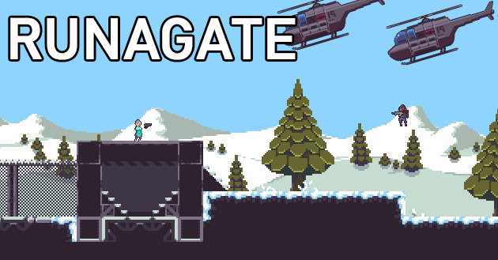

<h1 align="center">Hi 👋, I'm Oriel</h1>
<h3 align="center">A game developer and a Student for Mathematics and Computer Science</h3>

  

- 🔭 I’m currently working on **RunaGate** (A game for Android)

- 🌱 I’m currently learning **Python, Pandas and TensorFlow**

- 👨‍💻 All of my commercial projects are available at [XCompanyGames](https://xcompanygames.com/)

- 💬 Ask me about **Java, Python, C++, and game development**

- 📫 How to reach me:  professional mail: **Xcompanygames@gmail.com** , personal mail: **Orielpi@gmail.com**

- 📄 Get my CV at the link: [CV site](https://xcompanygames.com/CV_Oriel/)

<h3 align="left">Connect with me:</h3>

  
  

